Ursprünglich veröffentlicht auf [www.innoq.com](https://www.innoq.com/en/blog/prometheus-counters/)


I recently had to setup a few monitoring dashboards in [Grafana][] based on a Prometheus data source. I focussed on a couple of already existing counter metrics. I assumed that those are the simplest metrics available and it should be easy to extract some meaningful numbers and graphs out of them. It turned out that I had underestimated the complexity of Prometheus Counters. It took me quite some time to understand what I have to do to get the numbers and graphs that I wanted. In this article, I want you to join me on my way to understand how Counters in Prometheus work and how to query them to get the right information.

### Setting up a playground

To better understand the results of our upcoming queries, it's a good idea to have a little playground where we can create and increase a counter in a simple and controlled way. As an easy option we can create a simple spring-boot application and use the Micrometer Prometheus plugin to write our counter. You will find lots of resources on the internet describing how to set up a spring-boot app. To use the Micrometer Prometheus plugin we just need to add the appropriate dependency to our project. If we use Maven, we have to add the following lines to our `pom.xml` file.

```xml
<dependency>
    <groupId>io.micrometer</groupId>
    <artifactId>micrometer-registry-prometheus</artifactId>
</dependency>
```

In the `application.properties` file we need to enable the plugin and expose the Prometheus endpoint.  

```properties
management.endpoint.prometheus.enabled=true
management.endpoints.web.exposure.include=info,health,prometheus
```

After starting our app, it provides its metrics (at `http://localhost:8080/actuator/prometheus`) so that Prometheus is able to collect them.

To run Prometheus we can use the official Docker image. As we need to extend the configuration, we create a custom Docker image based on the official one and add our own configuration file.

```docker
FROM prom/prometheus:v2.9.2
ADD prometheus.yml /etc/prometheus/
```

Prometheus collects metrics from monitored targets by regularly requesting appropriate HTTP endpoints on these targets (called *scraping*). To register our spring-boot app (running on the host machine) as a new target, we add another scrape job to the default `prometheus.yml`.

```yml
    ...
    scrape_configs:
      ...
      - job_name: 'spring-sample-app'   
        metrics_path: '/actuator/prometheus'
        static_configs:
        - targets: ['host.docker.internal:8080']
```

After building and running our Docker image, Prometheus should start scraping our spring-boot app. 

```sh
docker build -t prometheus:test .
docker run -p 9090:9090 prometheus:test
```

We can verify this by looking at the targets status page (at `http://localhost:9090/targets`). It should display two targets, Prometheus itself and our spring-boot app, both with state `UP`. Using the graph section (at `http://localhost:9090/graph`), we should also be able to query some default metrics created by spring, e.g. `jvm_memory_used_bytes`.

Having everything in place, we can start our journey and create our own Counter. 


### What is a Counter?

According to the [Prometheus documentation][prometheus-counter], a Counter is a *single, monotonically increasing, cumulative metric*. 

Now, what does that mean?

A *single metric* means, that a Counter represents a single value, e.g. the number of orders created in a shop system. It's *monotonically increasing*, so it can only increase, usually one-by-one. It's a *cumulative metric*, so it always contains the overall value.

We can illustrate this with an example. Let’s create a new Counter `orders.created` and register it within our sample app.

```java
@Component
public class IncreaseCounterJob {

    private final Counter ordersCreatedCounter;

    public IncreaseCounterJob(MeterRegistry meterRegistry) {
        ordersCreatedCounter = meterRegistry.counter("orders.created");
    }

}
```

The Micrometer registry converts this into a Counter metric named `orders_created_total`. `_total` is the conventional postfix for counters in Prometheus. 

After restarting the sample app, we can open the graph page of the Prometheus web UI again to query our metric. Prometheus provides a query language called [*PromQL*][prometheus-promql] to do this. To query our Counter, we can just enter its name into the expression input field and execute the query. We get one result with the value 0 (ignore the attributes in the curly brackets for the moment, we will get to this later).

<figure id="fig1">
    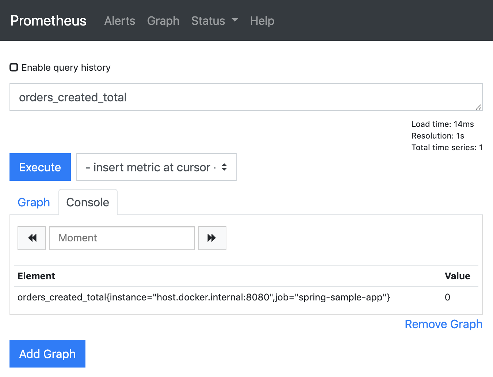
    <figcaption>Figure 1 – query result for our counter metric</figcaption>
</figure>

Next, let's adjust the sample app to increase the counter every few seconds.

```java
@Scheduled(fixedDelay = 5000)
public void increaseCounter() {
    ordersCreatedCounter.increment();
}
```

Refreshing the Prometheus query, we can see that the value increases as expected. 

If we switch to the graph tab, we can see that the result isn't the single value we saw so far, but a vector of values over time (called *instant vector*). The graph shows how our counter increased so far. We can adjust the range that the graph should show (called the *graph range*) to the last 5 minutes, using the controls above the diagram. 

<figure id="fig2">
    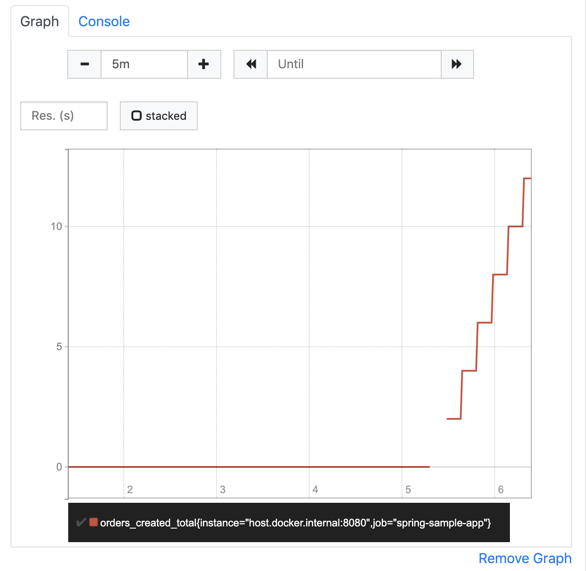
    <figcaption>Figure 2 – graph displaying the instant vector of our counter</figcaption>
</figure>


If we go for a fresh cup of coffee and refresh this query after coming back a few minutes later, we will see that the value has further increased. We can also see which value it had at which point in time (e.g. 5 minutes ago where the graph starts) when we move the mouse pointer over the graph. 

<figure id="fig3">
    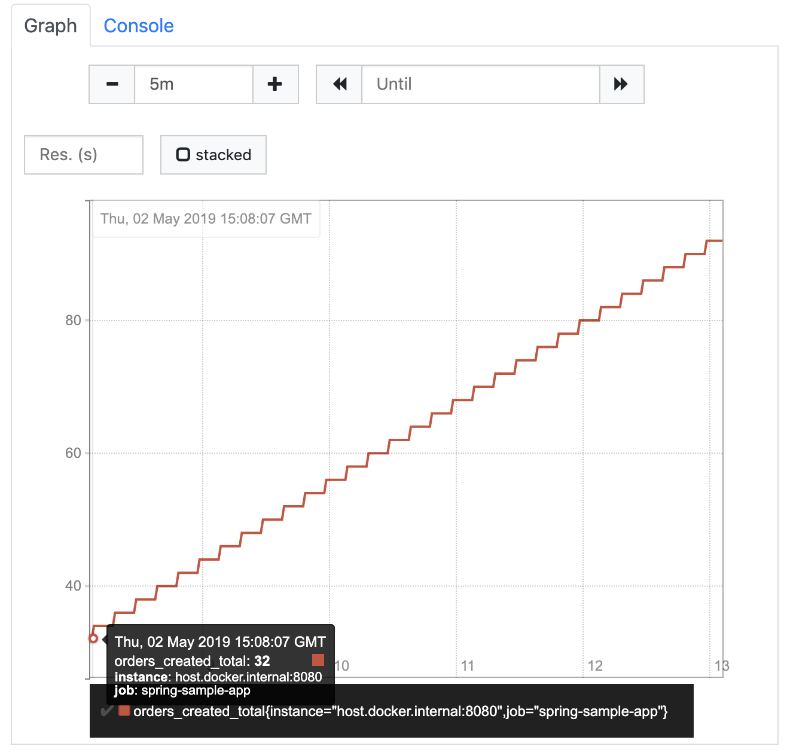
    <figcaption>Figure 3 – our counter graph after a few more minutes</figcaption>
</figure>

Imagine our shop runs for several days, weeks, months, or even longer. Our counter will increase and increase, and will always contain the total number of orders that were created since the point in time when we first created it. That's probably not what we want to know in our day to day business. 

<div style="background-color: #f7f7f7; padding: 0 1em;">
<p><em>Lesson learned: The current value of a Counter doesn't matter. What matters is, how it increases over time.</em></p>
</div>

### Orders created within the last 5 minutes 

A number that seems to be more interesting in our example is the *number of orders created within a certain period of time* (e.g. the last 5 minutes). The recent graph already gives us a hint on how to get this number: get the current value of the counter and subtract the value it had 5 minutes ago. Fortunately, PromQL provides the `increase` function, that does exactly what we’re after.

```
increase(orders_created_total[5m])
```

According to its [documentation][prometheus-increase] the `increase` function gets a *range vector* as an argument and calculates the increase of the counter value within this range. A range vector can be seen as a continuous subset of the instant vector, in our example all values of the `orders_created_total` instant vector within the last 5 minutes. The range is defined in square brackets and appended to the instant vector selector (the counter name in our case).

If we execute this query, we would expect to get the value 60 as a result, because our counter is increased by 1 every 5 seconds over the last 5 minutes. What we really get is something like 59.035953240763114. How come? 

Prometheus scraps its targets on a regular basis. As we did not specify an interval in the scrape job, Prometheus uses the default interval to scrape our sample app. This means that the current value of our counter is requested and updated every 10 seconds. When scraping a target, Prometheus reads the current values of all provided metrics and adds them as new instant values to the appropriate instant vectors in its database (the *time series database*). So, according to the database, the instant vector of our counter actually did not increase by 1 every 5 seconds, but by 2 every 10 seconds. 

When we execute our query, chances are high that we do this somewhere in between two scrapes. Let's say Prometheus scrapes our sample app every 10 seconds starting at 10:30:00 getting the following counter values

    10:30:00    orders_created_total=12
    10:30:10    orders_created_total=14
    10:30:20    orders_created_total=16
    10:30:30    orders_created_total=18
    ...
    10:35:00    orders_created_total=72
    10:35:10    orders_created_total=74
    10:35:20    orders_created_total=76

When we query for the last 5 minutes at 10:35:23, we will receive a range vector containing the following values

    10:30:30    orders_created_total=18
    ...
    10:35:00    orders_created_total=72
    10:35:10    orders_created_total=74
    10:35:20    orders_created_total=76

We don't get the value from 10:30:20, because that was more than 5 minutes ago. Because of that, if we calculate the increase within this range vector, the result is 58 (76 - 18). Now, that's not what Prometheus returns. The reason is (again according to the [documentation][prometheus-increase]) that the `increase` function tries to extrapolate missing values and estimate the values at the borders of the range. As you can see above, the result Prometheus returns is more exact than the one that we came up with, but it's still not the right value (we know because of the controlled environment we set up).

<div style="background-color: #f7f7f7; padding: 0 1em;">
<p><em>Lesson learned: Don't expect exact values from Prometheus. It's not designed to give you the exact number of anything, but rather an overview of what's happening.</em></p>
</div>


### Orders created over time

Another interesting value can be the *average number of orders per time interval*. We can get it using the `rate` function, which *calculates the per-second average rate of increase of the time series in the range vector* (see its [documentation][prometheus-rate]). We will talk about time series later in this article. Let's assume for now that it is simply an instant vector, like the one we discussed before. 

If we execute the query, we see the expected number which is approximately 0.2 orders per second (again, don't expect exact numbers). 

```
rate(orders_created_total[5m])
```

We can even extend the query to calculate the orders per minute by just multiplying the resulting instant vector with 60 seconds.

```
rate(orders_created_total[5m]) * 60
```

If we look at that orders/minute graph it looks like this: 

<figure id="fig4">
    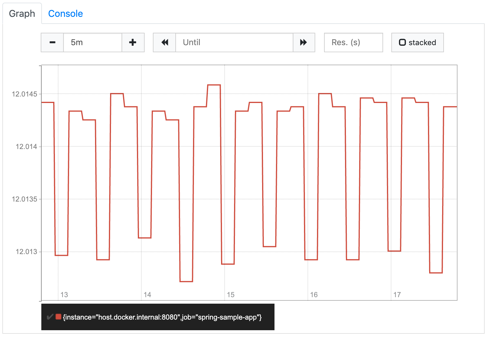
    <figcaption>Figure 4 – graph displaying the created orders per minute within the last 5 minutes</figcaption>
</figure>

It looks a little strange at first glance, because the values seem to jump up and down. But if we look at the labels on the Y axis, we see that this is because Prometheus shortens the scale so that the whole graph is visible as detailed as possible. In our case it means that it only shows the area around the 12 orders/minute, because all values are within this area. If we increase the graph range to one hour, Prometheus zooms out to show how the rate increased from 0 (before we started increasing the counter) to 12. The resulting graph matches our expectations.

<figure id="fig5">
    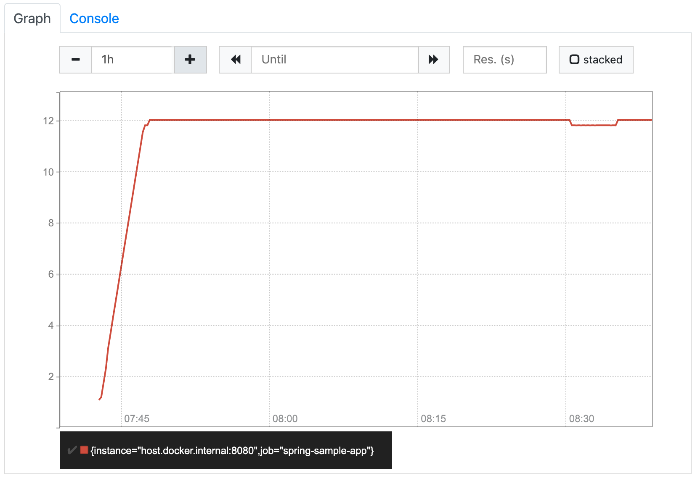
    <figcaption>Figure 5 – graph displaying the created orders per minute within the last hour</figcaption>
</figure>


So far, we've been using `5m` as the length of the range vector. You might be wondering how the length affects the `rate` function. The function does not seem to take it into account, as it always calculates the per-second value. But if we look at the documentation again, it says *the per-second **average** rate*. That means, for each instant `t` in the provided instant vector the `rate` function uses the values from `t - 5m` to `t` to calculate its average value. So, for example, the value at 08:30 describes the average number of orders per minute that were created between 08:25 and 08:30, the value at 08:31 describes the average number of orders per minute that were created between 08:26 and 08:31, and so on...

In our very simple example with its constant rate, this range does not make any difference. To see the effect it has, let's take a look at a real world example. The following two diagrams show exactly the same orders/minute metric. The only difference is the range that was used to calculate the average values. The first graph shows the `rate(orders_created_total[5m])` values, the second one the `rate(orders_created_total[1h])` values.

<figure id="fig6a">
    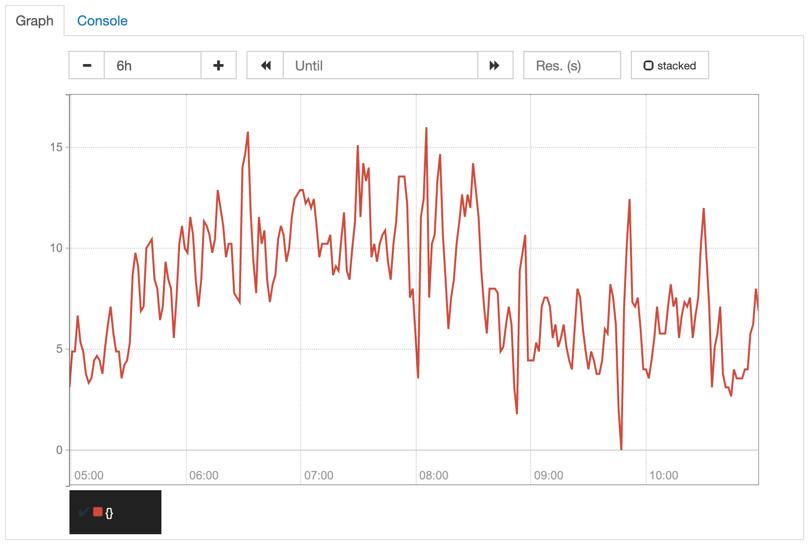
    <figcaption>Figure 6a – average orders per minute calculated based on 5m range</figcaption>
</figure>
<figure id="fig6b">
    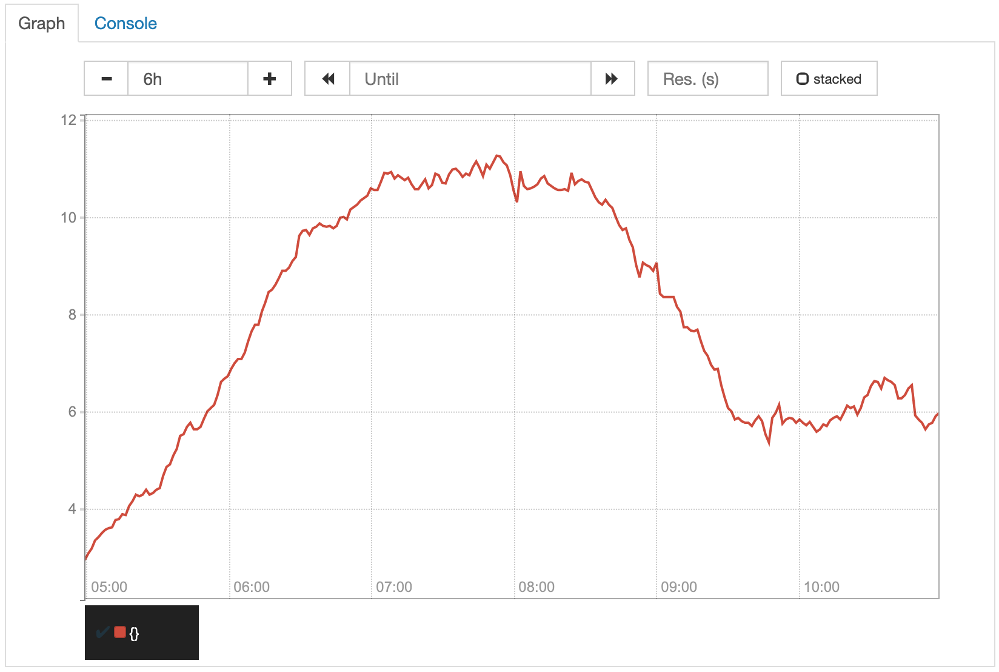
    <figcaption>Figure 6a – average orders per minute calculated based on 1h range</figcaption>
</figure>

Because of the smaller range, the values displayed in the first graph are more exact. Due to that, the unsteadiness of its increase, that is perfectly normal in most cases, is reflected more directly in the graph. Although you can still identify the overall trend, it is clearly more visible in the second graph, where the unsteadiness is flattened by the larger average ranges. For our orders counter example, the second graph would probably be what we want to have.

<div style="background-color: #f7f7f7; padding: 0 1em;">
<p><em>Lesson learned: You might not want to see the exact values.</em></p>
</div>


### Different attributes of orders

With the two queries we tried so far, we already have a good overview of how many orders were created in our shop. Usually, there are different types of orders that we might want to see in our metrics as well. For example, our shop might create orders from different countries or allow different payment and shipping methods. 

The first thing that comes into our minds might be to create separate counters for those different types of orders, e.g. `de_orders_created_total`, `at_orders_created_total`, and so on. This would lead to registering counters for every possible combination of attributes that we might want to query. We would also have to ensure within our shop, where those counters are written, that for every created order all the appropriate counters are increased. Fortunately, Micrometer/Prometheus provides a better way to handle this.

We can add some *tags* (as they are called in Micrometer) or *labels* (the same concept in Prometheus) to our counter and set the appropriate attribute values every time we increase it. To keep the implementation of our sample app as simple as possible, but have some variation within our values, let's use separate scheduler jobs (with different delays) for two different countries and choose the payment and shipping methods randomly.

```java
@Component
public class IncreaseCounterJob {

    private static final List<String> availablePaymentMethods = Arrays.asList("INVOICE", "CREDITCARD", "PAYPAL");
    private static final List<String> availableShippingMethods = Arrays.asList("STANDARD", "EXPRESS");

    private final MeterRegistry meterRegistry;

    public IncreaseCounterJob(MeterRegistry meterRegistry) {
        this.meterRegistry = meterRegistry;
    }

    @Scheduled(fixedDelay = 1000)
    public void simulateNewOrderDE() {
        meterRegistry.counter("orders.created",
                "country", "DE",
                "payment_method", randomPaymentMethod(),
                "shipping_method", randomShippingMethod())
        .increment();
    }

    @Scheduled(fixedDelay = 5000)
    public void simulateNewOrderAT() {
        meterRegistry.counter("orders.created",
                "country", "AT",
                "payment_method", randomPaymentMethod(),
                "shipping_method", randomShippingMethod())
        .increment();
    }

    private String randomPaymentMethod() {
        int randomIndex = new Random().nextInt(availablePaymentMethods.size());
        return availablePaymentMethods.get(randomIndex);
    }

    private String randomShippingMethod() {
        int randomIndex = new Random().nextInt(availableShippingMethods.size());
        return availableShippingMethods.get(randomIndex);
    }  
}
```

A *label* is an attribute of a metric (not only a counter) that has to be provided whenever modifying (e.g. increasing) it. In our example, we define three labels for our counter: `country`, `payment_method` and `shipping_method`. Whenever we increment the counter, we specify the appropriate values for those labels (e.g. `country='DE'`, `payment_method='INVOICE'` and `shipping_method='STANDARD'`). With Micrometer we do this by adding pairs of Strings containing the key and value of a label in addition to the counter name.

If we query our `orders_created_total` metric after restarting our sample app, we no longer see only one result but many. Within the curly brackets we ignored so far, we can see the keys and values of our three labels (the other two labels `job` and `instance` are automatically added by Prometheus when scraping the values from the several targets).

<figure id="fig7">
    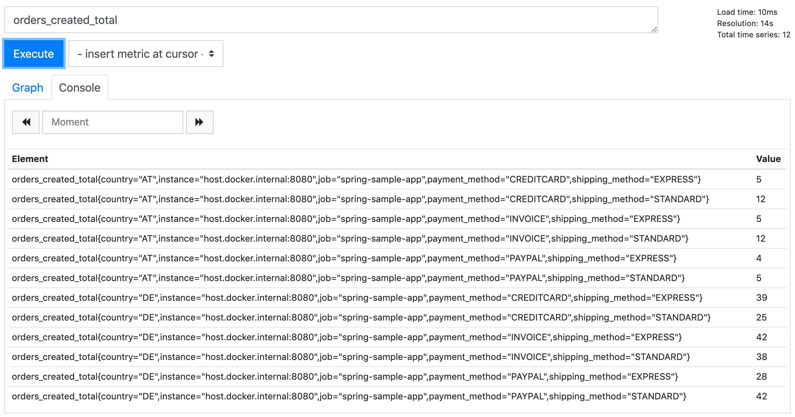
    <figcaption>Figure 7 – query result for our labeled counter</figcaption>
</figure>

The reason why we see those multiple results is that for every metric (e.g. Counter) Prometheus creates a separate value vector (called *time series*) for every combination of label values. So, instead of simply getting an *instant vector* containing the values, what we really get when we query our simple metric is an *instant vector* containing one or many *time series* – each containing a vector of values for that particular counter and label values at the different instants. We can see the different time series more clearly when we switch to the graph again.

<figure id="fig8">
    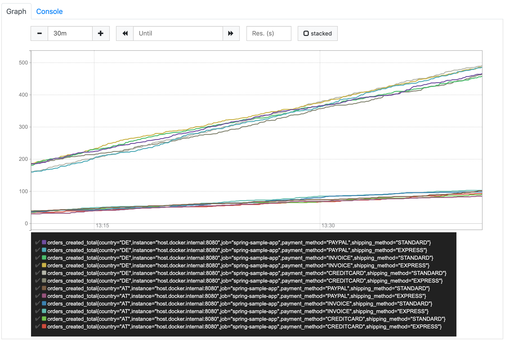
    <figcaption>Figure 8 – graph showing the different time series of our labeled counter</figcaption>
</figure>

Due to the fact that Prometheus creates separate time series for each combination of label values, only labels with a small number of possible values should be used. Using an order number, which is different for every order that is created, as a label is clearly a bad idea. It would result in one time series per order where the value is set to 1 and will never increase. Often, enumerations within our domain model are good candidates for labels. 

Now, with these labels in place, let's have a look at our previous queries again.

If we execute our query to get the number of orders created within the last 5 minutes, we also receive separate results for the separate time series.

<figure id="fig9">
    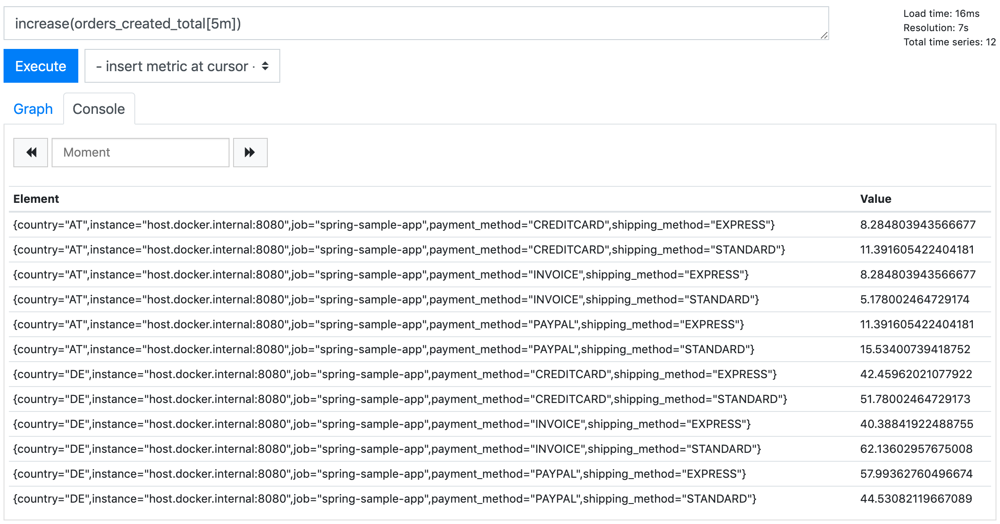
    <figcaption>Figure 9 – increase query results for our labeled counter</figcaption>
</figure>

PromQL allows us to filter the time series by defining a set of label expressions in curly brackets (see [documentation][prometheus-instant-vector-selectors]). 

To receive exactly one of those time series, we can execute the following query.

```
increase(orders_created_total{country="DE",payment_method="INVOICE",shipping_method="STANDARD"}[5m])
```

But how do we get the overall number of orders? We clearly don't want to query all the separate values to sum them up on our own. Well, Prometheus will do this for us if we use the `sum` aggregation operator (see [documentation][prometheus-aggregation-operators]).

```
sum(increase(orders_created_total[5m]))
```

This query returns the overall number of orders created within the last 5 minutes, ignoring all the different label values. We can combine `sum` with some label expressions, e.g. to get the number of all DE orders. A better option might be to tell Prometheus to respect selected labels when aggregating, e.g. calculate the sums by country.

```
sum(increase(orders_created_total[5m])) by (country)
```

<figure id="fig10">
    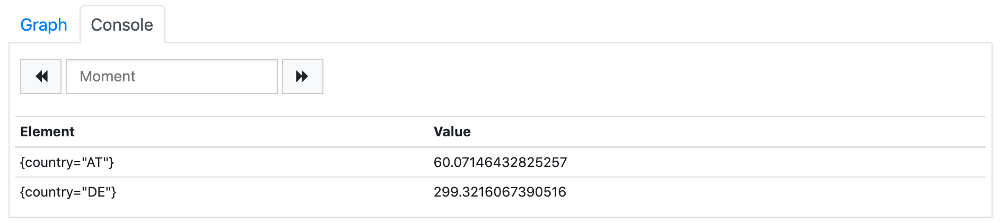
    <figcaption>Figure 10 – increase query result summed by country</figcaption>
</figure>


As the result of this query we get two records, one for each country label value. All other labels are ignored and removed from the result set. In analytics systems that are based on Prometheus (e.g. [Grafana][]), this type of query can be used to generate pie charts or repeating (parameterized) components (e.g. single value graphs that are rendered for each available country label value and show the number of orders for that country).

The other query we defined before, the average number of orders created per minute, can be used for multiple time series without needing any modification. As we would usually display it as a graph, it will just show the multiple time series out of the box. 

<figure id="fig11">
    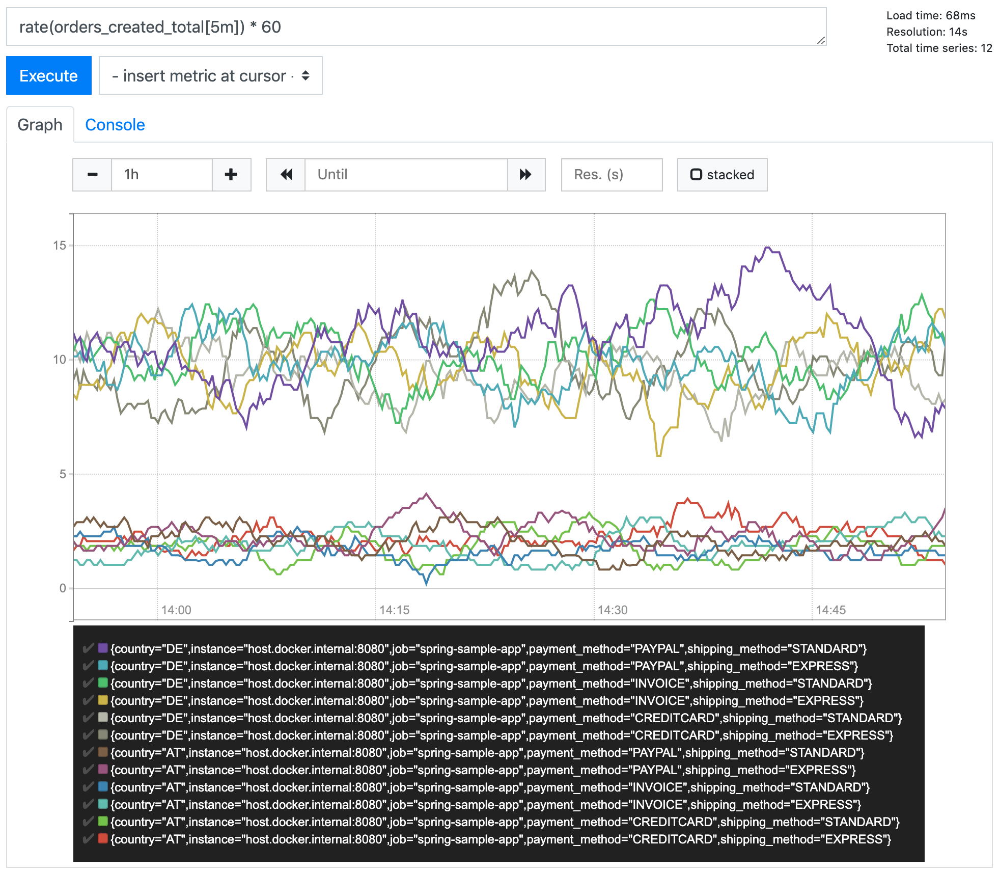
    <figcaption>Figure 11 – graph displaying the created orders per minute for multiple time series</figcaption>
</figure>

Of course, we can also perform some filtering or aggregation the same way as described above, like just showing DE metrics

```
rate(orders_created_total{country="DE"}[1h]) * 60
```

or aggregating by payment method

```
sum(rate(orders_created_total[1h]) * 60) by (payment_method)
```

Notice: In the latter case, when combining `rate` with some aggregation, the `rate` has to be done first, the aggregation second, see [documentation][prometheus-rate].


<div style="background-color: #f7f7f7; padding: 0 1em;">
<p><em>Lesson learned: Add some labels to allow to drill down and show more details</em></p>
</div>


### A really simple metric

We saw that a Counter, which looks really simple at first glance, can turn out to be more complex than expected. Prometheus provides some other types of metrics. One of them is the *gauge*. According to the [documentation][prometheus-gauge] it *represents a single numerical value that can arbitrarily go up and down.* So, like a counter, a gauge also represents a single value, but instead of only increasing, it can also decrease. That sounds even more complex, doesn't it?

Let's see what we get when we execute a simple gauge query. In the setup section at the very beginning of this article, I already mentioned one of the metrics that are automatically created by spring.

```
jvm_memory_used_bytes
```

When we query this metric, we see the memory usage of our sample app over the time (differentiated by `area` and `id`).

<figure id="fig12">
    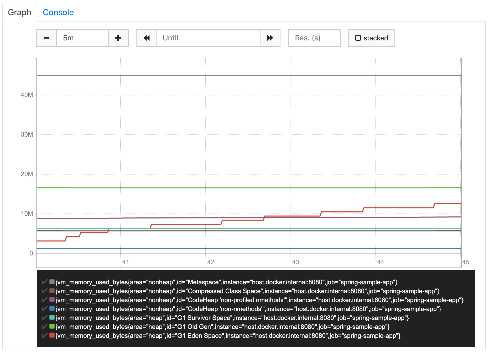
    <figcaption>Figure 12 – graph displaying the jvm_memory_used_bytes gauge</figcaption>
</figure>

That's it. Nothing more to do. Now, that was really easy.

Because of the fact that a gauge value can increase and decrease over time, it's usually used to contain the current value of something, e.g. the memory usage. So, other than for counters, for gauges it is the current value that is of interest. We don't have to calculate how it increased (or decreased) over time because that's exactly what the instant vector of the gauge already shows.

So, if we really want to have some simple metrics, we should look for gauges

<div style="background-color: #f7f7f7; padding: 0 1em;">
<p><em>Lesson learned: the simplest metric available in Prometheus is not a Counter but a Gauge</em></p>
</div>

---


[Grafana]: https://grafana.com/
[prometheus-counter]: https://prometheus.io/docs/concepts/metric_types/#counter
[prometheus-promql]: https://prometheus.io/docs/prometheus/latest/querying/basics/
[prometheus-increase]: https://prometheus.io/docs/prometheus/latest/querying/functions/#increase
[prometheus-rate]: https://prometheus.io/docs/prometheus/latest/querying/functions/#rate
[prometheus-instant-vector-selectors]: https://prometheus.io/docs/prometheus/latest/querying/basics/#instant-vector-selectors
[prometheus-aggregation-operators]: https://prometheus.io/docs/prometheus/latest/querying/operators/#aggregation-operators
[prometheus-gauge]: https://prometheus.io/docs/concepts/metric_types/#gauge